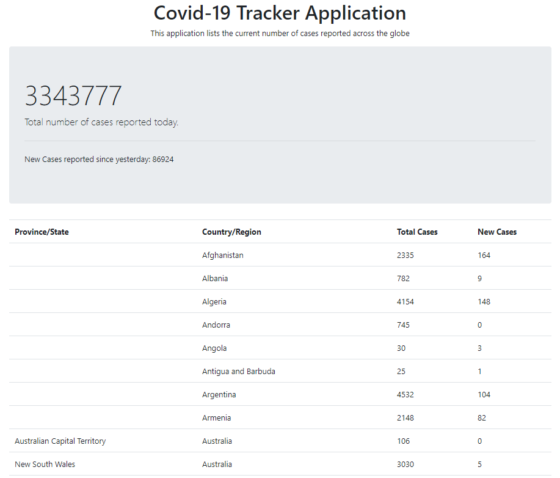

# Covid-19 Tracker Application
This application lists the current number of cases reported across the globe. There is a scheduled service which fetch the data, daily, from CSSEGISandData website. Used:
* JDK 12
* @Scheduler for the daily reading
* Commons CSV as csv reader 

